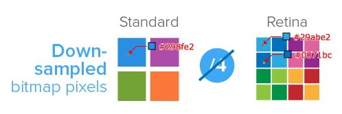
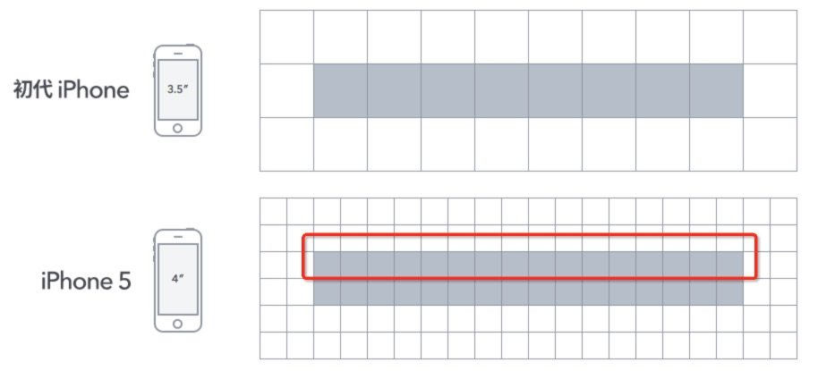

## 聊一聊移动端适配

> 阿里一面的时候被问到了对移动端适配的认识，后来就rejected了，感觉我们工作室这块一直做得比较少，所以我尝试性扫盲科普一下，以后要做起来也基本有个概念吧

### viewport视口

viewport的功能在于控制`<html>`元素，当我们设置一个`<div>`元素的宽度为`10%`时，实际上这`10%`是对于其父元素的，那父元素是谁呢，追溯上去`<body>` -> `<html>`，其实最终会追溯到`<html>`的宽度，而`<html>`的宽度也就是viewport的宽度。

viewport是严格的等于浏览器的窗口，而且不能通过CSS修改它，它的宽度就是为浏览器窗口的宽度


- **layout viewport**：没有用meta标签声明之前的viewport，可以通过`document.documentElement.clientWidth`来获取它的宽度


- **visual viewport**：代表浏览器可视区域的大小，可以通过`window.innerWidth` 来获取它的宽度


- **ideal viewport**：使用meta标签声明viewport之后，可以让viewport适应设备的宽度进行定义

| width         | 设置**\*layout viewport***  的宽度，为一个正整数，或字符串"width-device" |
| ------------- | ------------------------------------------------------------ |
| initial-scale | 设置页面的初始缩放值，为一个数字，可以带小数                 |
| minimum-scale | 允许用户的最小缩放值，为一个数字，可以带小数                 |
| maximum-scale | 允许用户的最大缩放值，为一个数字，可以带小数                 |
| height        | 设置**\*layout viewport***  的高度，这个属性对我们并不重要，很少使用 |
| user-scalable | 是否允许用户进行缩放，值为"no"或"yes", no 代表不允许，yes代表允许 |


### 像素

像素就是`px`

而其实像素存在有两种：**设备像素** 和 **设备独立像素**

1. 设备像素：屏幕的物理像素，任何设备屏幕的物理像素的数量都是固定不变的
2. 设备独立像素：在CSS、JS中使用的一个抽象的单位，每个屏幕上用`px`渲染出来的长度基本一致
3. 设备像素比：设备像素比简称为`dpr`，其定义了物理像素和设备独立像素的对应关系，可以通过`window.devicePixelRatio`访问到设备的`dpr`


就比如说：iPhone5的分辨率为`1136pt x 640pt`，也就是指屏幕上垂直有1136个物理像素，水平上有640个物理像素（物理像素就是上面所说的设备像素）


**图片展示问题**

理论上，1个位图像素对应于1个物理像素，图片才能得到完美清晰的展示。

在普通屏幕下是没有问题的，但是在retina屏幕下就会出现位图像素点不够，从而导致图片模糊的情况。




如上图：对于dpr=2的retina屏幕而言，1个位图像素对应于4个物理像素，由于单个位图像素不可以再进一步分割，所以只能就近取色，从而导致**图片模糊**(注意上述的几个颜色值)。

所以，对于图片高清问题，比较好的方案就是`两倍图片`，就比如说：一张200 * 300的图片，需要再提供一个400 * 600的版本


**border: 1px的问题**

这个问题其实不算问题，但是差别真的挺大的

具体如下：`retina`是典型的`dpr`为2的屏幕，所以物理像素也比较小一块，但是在正常设置`viewport`的情况下，我们通过`1px`设置宽度，是会覆盖到两个物理像素的，如下图。



其实这没什么问题，因为`dpr`为1的屏幕也是这么粗，但是`retina`屏有这样的分辨率优势，我们要充分去利用他。**我这里只给出比较官方的解决方法，还有一些hack方法，可以自行了解**

所以针对于`dpr`为2 的屏幕，我们通过设置`viewport`的缩放，让CSS的`1px`等于它屏幕的物理像素，于是我们就可以充分利用`retina`高分辨率的优势写出更高清的页面。

```html
<meta name="viewport" content="width=640,initial-scale=0.5,maximum-scale=0.5, minimum-scale=0.5,user-scalable=no">
```


**设置页面缩放可以使得1个CSS像素(1px)由1个设备像素来显示，从而提高显示精度；因此，设置1/dpr的缩放视口，可以画出1px的边框。**

​                                             

### rem配合font-size布局

移动端布局，为了适配各种大屏手机，目前最好用的方案莫过于使用相对单位`rem`。

基于rem的原理，我们要做的就是: **针对不同手机屏幕尺寸和dpr动态的改变根节点html的font-size大小(基准值)**。

```js
// 公式
基准值 = document.documentElement.clientWidth * dpr / 10

// 换算公式
rem = px / 基准值
```

然后页面内所有的元素都使用`rem`进行定位放置

- 乘以`dpr`是因为`viewport`会根据`dpr`进行缩放，从而提高精度
- 除以10是随便除的。。。弄小一点

这个动态修改根节点`font-size`的工作可以交给`JS`做，也可以通过`CSS`的媒体查询做，但我觉得通过`JS`计算会比较准确


### 字体大小问题

对于字体的问题，设计上的要求是，任何手机屏幕上的字体大小必须一样，这就代表着我们需要动态地覆盖掉全局根节点的那个字体大小，我们通常会使用属性选择器并且动态根据`dpr`命名该属性，通过这样设置后续的字子点字体大小

```css
font-size: 16px;
[data-dpr="2"] input {
  font-size: 32px;
}
```


### 手淘的移动端适配方案

事实上他做了这几样事情：

- 动态改写`<meta>`标签
- 给`<html>`元素添加`data-dpr`属性，并且动态改写`data-dpr`的值
- 给`<html>`元素添加`font-size`属性，并且动态改写`font-size`的值


---

## 题外话：Promise

```js
var p = new Promise((res, rej) => {
    rej(3)
})
p
.then((res) => {
    console.log(res)
}, (rej) => {
    console.log(rej)
})
.then((res) => {
    console.log(res)
}, (rej) => {
    console.log(rej)	// 这里会不会执行
})
```

